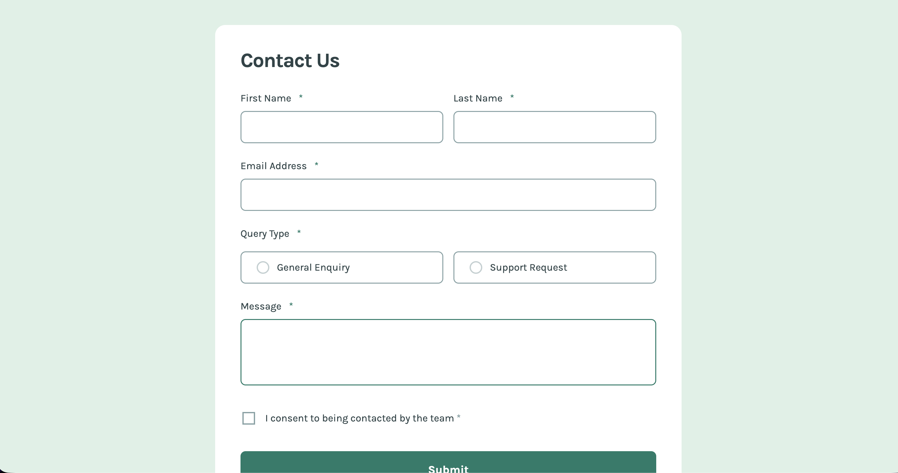

# Frontend Mentor - Contact form solution

This is a solution to the [Contact form challenge on Frontend Mentor](https://www.frontendmentor.io/challenges/contact-form--G-hYlqKJj). Frontend Mentor challenges help you improve your coding skills by building realistic projects.

## Table of contents

- [Overview](#overview)
  - [The challenge](#the-challenge)
  - [Screenshot](#screenshot)
  - [Links](#links)
- [My process](#my-process)
  - [Built with](#built-with)
  - [What I learned](#what-i-learned)
  - [Continued development](#continued-development)
  - [Useful resources](#useful-resources)
  - [AI Collaboration](#ai-collaboration)
- [Author](#author)

## Overview

### The challenge

Users should be able to:

- Complete the form and see a success toast message upon successful submission
- Receive form validation messages if:
  - A required field has been missed
  - The email address is not formatted correctly
- Complete the form only using their keyboard
- Have inputs, error messages, and the success message announced on their screen reader
- View the optimal layout for the interface depending on their device's screen size
- See hover and focus states for all interactive elements on the page

### Screenshot



### Links

- Solution URL: [Solution](https://github.com/hectorlil48/frontendMentor-contact-form)
- Live Site URL: [Live Site](https://frontend-mentor-contact-form-alpha.vercel.app/)

## My process

### Built with

- Semantic HTML5 markup
- CSS custom properties
- Flexbox
- Mobile-first workflow
- [React](https://reactjs.org/) - JS library
- [TypeScript](https://www.typescriptlang.org/)

### What I learned

1. TypeScript with React forms
   The biggest learning was typing form state and event handlers. Using a custom type for form data and typed onChange handlers was new for me:

```ts
type FormData = {
  firstName: string
  lastName: string
  email: string
  queryType: []
  message: string
  consent: boolean
}

const [formData, setFormData] = useState<FormData>({...})
```

2. Handling multiple input types with one handler
   Using a single handleChange function for text inputs, textarea, and checkboxes by checking e.target.type:

```ts
const { name, value, type } = e.target;
const checked =
  type === "checkbox" ? (e.target as HTMLInputElement).checked : false;
setFormData((prevData) => ({
  ...prevData,
  [name]: type === "checkbox" ? checked : value,
}));
```

3. Accessibility on form elements
   Using aria-hidden="true" on decorative asterisks and required on inputs instead, and using fieldset and legend for checkbox button groups.

### Continued development

I want to continue practicing TypeScript in future projects, specifically:

- Getting more comfortable with typing props when breaking components into smaller pieces
- Learning more advanced TypeScript patterns like union types and generics
- Improving my form validation approach — I'd like to explore a validation library like Zod or React Hook Form for more complex forms in the future
- Continuing to build accessible UI components and improving my understanding of WCAG standards

### Useful resources

TypeScript - Helpful to look at documention.

### AI Collaboration

AI Tools Used:
I used Claude (browser) and Claude Code (VS Code extension) throughout this project.
How I used them:

Asked questions about TypeScript concepts I hadn't used before — typing form state, event handlers, and generics
Worked through CSS decisions like textarea height at different breakpoints and form layout
Got suggestions for refactoring and cleaner approaches after I'd already written something
Debugged issues by describing what wasn't working rather than asking for complete solutions

What worked well:
Using AI as a collaborator rather than a code generator. I made the structural decisions — component breakdown, BEM naming, Figma values — and used AI to fill in knowledge gaps and explain concepts I hadn't seen before.
What didn't work as well:
Sometimes got slightly different answers between Claude Code and the browser version on TypeScript specifics — learned to trust Claude Code for version specific syntax since it could see my actual project files.

## Author

- Website - [Hector Ramirez](https://www.hectorramirez.dev/)
- Frontend Mentor - [@hectorlil48](https://www.frontendmentor.io/profile/hectorlil48)
- LinkedIn - [@hector-ramirez-6a6509170](https://www.linkedin.com/in/hector-ramirez-6a6509170/)
